<h1 align="center">Всем привет! Меня зовут Владислав.</h1>
<h3 align="center">Программист, разработчик, системный администратор.</h3>

<h3 align="center">Главный экран приложения</h3>
<h3  align="center">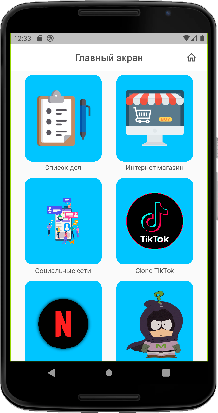</h3>

<h3 align="center">Тестовый проект на список дел</h3>
<h4 align="center"> Главный экран приложения TodoList </h4>
<h5  align="center">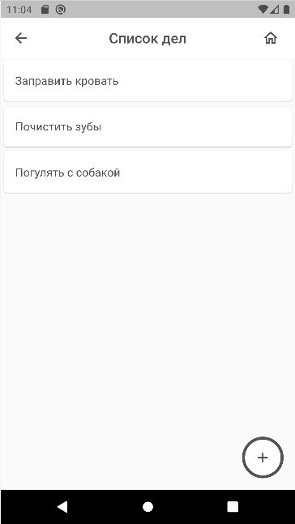</h5>
<h4 align="center"> Добавление нового дела в приложение </h4>
<h5  align="center">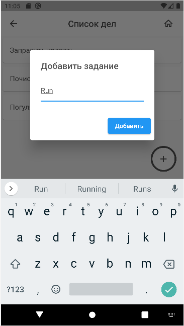</h5>
<h4 align="center"> Свайп дела (выполнение) вправо или в лево </h4>
<h5  align="center">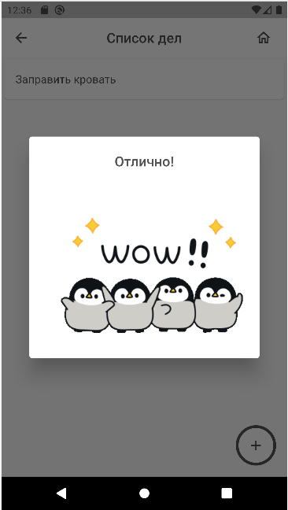</h5>

Тестовый проект на интернет магазин

Тестовый проект на клон Тик Тока
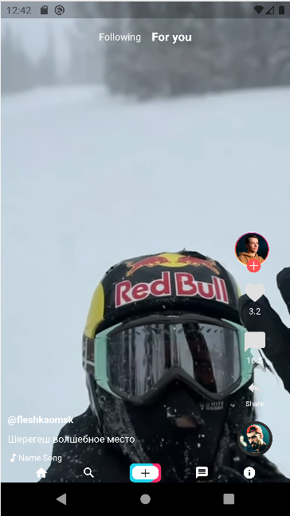
Тестовый проект на клон Netflix
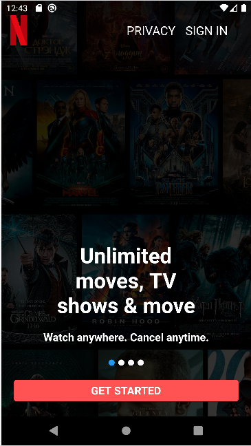
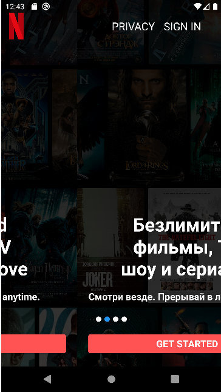

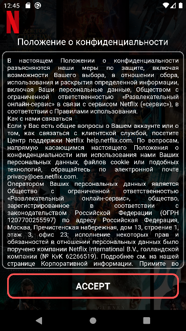
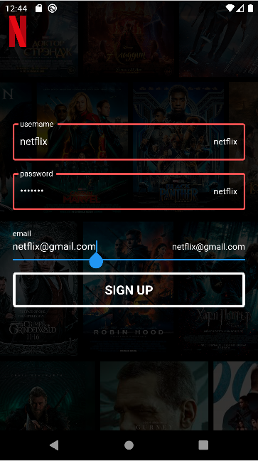
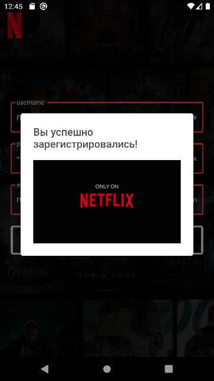
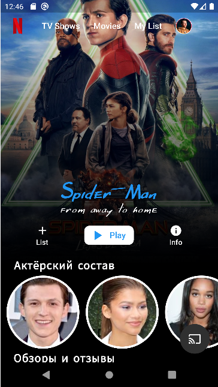
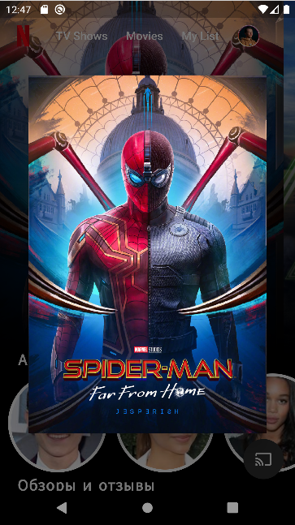
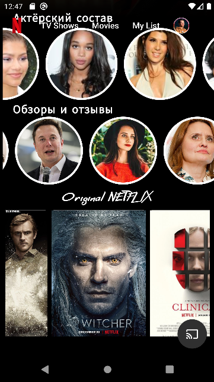

