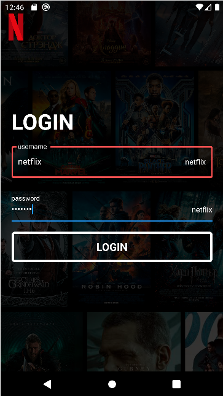

<h1 align="center">Всем привет! Меня зовут Владислав.</h1>
<h3 align="center">Программист, разработчик, системный администратор.</h3>

<h3 align="center">Главный экран приложения</h3>
<h3  align="center"></h3>

<h3 align="center">Тестовый проект на список дел</h3>
<h4 align="center"> Главный экран приложения TodoList </h4>
<h5  align="center"></h5>
<h4 align="center"> Добавление нового дела в приложение </h4>
<h5  align="center"></h5>
<h4 align="center"> Свайп дела (выполнение) вправо или в лево </h4>
<h5  align="center"></h5>

<h3 align="center">Тестовый проект интернет магазин</h3>
<h4 align="center"> Главный экран интернет магазина </h4>
<h5  align="center"></h5>
<h4 align="center"> Карточка офисной сумки</h4>
<h5  align="center"></h5>

<h3 align="center">Тестовый проект "клон Тик Тока"</h3>
<h5  align="center"></h5>

<h3 align="center">Тестовый проект "клон netflix"</h3>
<h4 align="center"> Главный экран приложения Netflix </h4>
<h5  align="center"></h5>
<h4 align="center"> Главный экран приложения Netflix можно "свайпать" в право и влево, сделано 4 экрана(подложки) на 4 разных языках </h4>
<h5  align="center"></h5>
<h4 align="center"> Политика компании с кнопкой подтвердить </h4>
<h5  align="center"></h5>
<h4 align="center"> Регистрация нового аккаунта (тестовый аккаунт) </h4>
<h4 align="left"> Login: &nbsp;&nbsp;&nbsp;netflix </h4>
<h4 align="left"> Password: &nbsp;&nbsp;netflix </h4>
<h4 align="left"> Email: &nbsp;&nbsp;&nbsp;netflix@gmail.com </h4>
<h5  align="center"></h5>
<h4 align="center"> Успешная регистрация в приложении </h4>
<h5  align="center"></h5>
<h4 align="center"> Вход в личный аккаунт (login: netflix | password: netflix) </h4>
<h5  align="center"></h5>
<h4 align="center"> Экран фильма (для примера взят Spider Man from away to home) </h4>
<h5  align="center"></h5>
<h4 align="center"> Экран одного из постеров фильма </h4>
<h5  align="center"></h5>
<h4 align="center"> Экран нижней части странице о фильме </h4>
<h5  align="center"></h5>